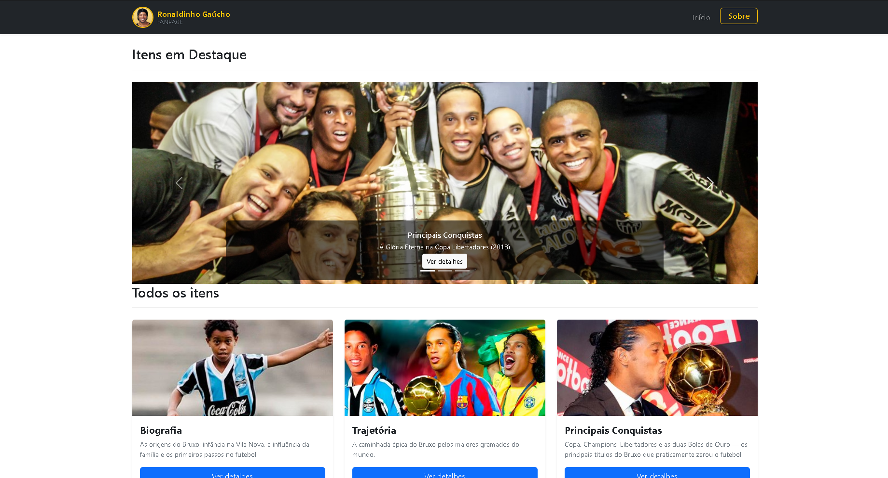

# Trabalho Prático - Semana 11

Nesta atividade, vamos evoluir o projeto em que estamos trabalhando nesse semestre, acrescentando a página de detalhes.

Imagine que a página principal (home-page) mostre um visão dos vários itens que existem no seu site. Ao clicar em um item, você é direcionado pra a página de detalhes. A página de detalhe vai mostrar todas as informações sobre o item do seu projeto, seja esse item uma notícia, filme, receita, lugar turístico ou evento.

## Informações Gerais

- Nome: João Pedro Sousa Costa
- Matricula: 929010
- Decreva brevemente seu projeto: Site dedicado ao Ronaldinho Gaúcho com home-page exibindo cards e carrossel dinâmicos, e página de detalhes com informações completas sobre Biografia, Trajetória, Conquistas, Melhores Momentos, Fora de Campo e Legado.

## Prints do trabalho




## Dados em JSON
Inclua aqui a estrutura de dados definida por você para o projeto com pelo menos dois exemplo de dados.


```json

var data = {
    itens: [
        {
            id: 1,
            nome: "Biografia",
            descricaoCurta: "As origens do Bruxo: infância na Vila Nova, a influência da família e os primeiros passos no futebol.",
            descricaoCompleta: "Ronaldo de Assis Moreira nasceu em 21 de março de 1980, em Porto Alegre. Criado em ambiente humilde mas rodeado de bola, superou a perda precoce do pai e, guiado pelo irmão Assis, transformou talento em genialidade para se tornar o maior meia-atacante da sua geração.",
            dadosComplementares: { Nascimento: "21/03/1980", Local: "Porto Alegre - RS", Posicao: "Meia-Atacante" },
            destaque: false,
            imagemPrincipal: "assets/img/biografiaaaaaaa.png",
            video: { titulo: "A HISTÓRIA DE RONALDINHO GAÚCHO - O BRUXO! (clique em assistir video para poder abrir o link do youtube)", url: "https://www.youtube.com/embed/frdW0xzbvzI?si=5vE24q17j3q3xoHb" },
            secoes: [
                {
                    titulo: "Infância na Vila Nova e o Futebol de Rua",
                    texto: "Nascido no bairro Vila Nova, em Porto Alegre, Ronaldinho cresceu jogando peladas em campos de terra. Era tão habilidoso que, ainda criança, driblava adultos com facilidade. Aquele contato diário com a bola moldou a intimidade absurda que ele teria com ela pelo resto da vida.",
                    imagem: "assets/img/ronaldinho_crainca_rua.png"
                },
                {
                    titulo: "A Influência do Irmão Assis",
                    texto: "Seu irmão Roberto de Assis era promessa do Grêmio e assumiu papel de pai após o falecimento precoce de Seu João. Assis guiou cada passo da carreira do irmão e depois se tornou seu empresário. A dupla foi inseparável por décadas dentro e fora dos gramados.",
                    imagem: "assets/img/assis-irmao.png"
                },
                {
                    titulo: "A Perda do Pai — Um Momento Marcante",
                    texto: "Quando tinha apenas 8 anos, Ronaldinho perdeu seu pai, João de Assis Moreira, vítima de um ataque cardíaco. Apaixonado por futebol e grande incentivador dos filhos, João teve papel fundamental nos primeiros passos de Ronaldinho no esporte. A perda marcou profundamente sua infância e se tornou uma motivação para buscar o sucesso e honrar o legado da família.",
                    imagem: "assets/img/pai-ronaldinho.png"
                },
                {
                    titulo: "Os 23 Gols e o Mundial Sub-17",
                    texto: "Nas categorias de base do Grêmio, sua genialidade chamou atenção do país inteiro quando marcou todos os 23 gols de uma vitória no campeonato infantil. Em 1997, foi o grande destaque do Brasil no título do Mundial Sub-17 no Egito.",
                    imagem: "assets/img/sub17.png"
                },
                {
                    titulo: "Estreia Profissional no Grêmio",
                    texto: "Sua estreia no time profissional do Grêmio aconteceu em 1998, na Copa Libertadores. O jovem de dentes grandes rapidamente conquistou a titularidade e o coração da torcida tricolor gaúcha, marcando gols decisivos que ninguém esperava de um garoto tão novo.",
                    imagem: "assets/img/estreia-gremio.png"
                }
            ]
        },
        {
            id: 2,
            nome: "Trajetória",
            descricaoCurta: "A caminhada épica do Bruxo pelos maiores gramados do mundo.",
            descricaoCompleta: "Uma jornada que começou nos campos de terra de Porto Alegre, passou pela França no PSG, transformou o Barcelona em potência mundial, desfilou em Milão e viveu renascimento épico no Brasil com Flamengo, Atlético Mineiro e Fluminense.",
            dadosComplementares: { Clubes: "Grêmio, PSG, Barcelona, Milan, Flamengo, Atlético-MG, Querétaro, Fluminense", Selecao: "97 Jogos / 33 Gols" },
            destaque: false,
            imagemPrincipal: "assets/img/trajetoriaaa.png",
            video: { titulo: "Veja os clubes que Ronaldinho gaúcho jogou (clique em assistir video para poder abrir o link do youtube)", url: "https://www.youtube.com/embed/Qlv709BDTdI?si=0c1U1oWcONs_mKXv" },
            secoes: [
                {
                    titulo: "Grêmio — O Surgimento de um Gênio",
                    texto: "Revelado pelo Grêmio, Ronaldinho chamou atenção desde cedo por sua habilidade incomum, dribles desconcertantes e criatividade com a bola. Em Porto Alegre, conquistou o Campeonato Gaúcho de 1999 e deu os primeiros passos de uma carreira que encantaria o mundo inteiro. Em 141 jogos pelo Tricolor, marcou 68 gols.",
                    imagem: "assets/img/gremio.jpg"
                },
                {
                    titulo: "PSG — A Europa Descobre o Bruxo",
                    texto: "Em 2001, Ronaldinho chegou ao Paris Saint-Germain em uma negociação polêmica. Na França, com gols e atuações memoráveis, abriu as portas do futebol europeu de elite. Pelo PSG, foram 77 jogos e 25 gols.",
                    imagem: "assets/img/psg.png"
                },
                {
                    titulo: "Barcelona — O Rei do Futebol Mundial",
                    texto: "Contratado pelo Barcelona em 2003, Ronaldinho liderou a reconstrução do clube e viveu o auge da carreira. Conquistou duas La Ligas, duas Supercopas da Espanha e a UEFA Champions League de 2006. No mesmo período, venceu duas vezes o prêmio de Melhor Jogador do Mundo da FIFA e a Bola de Ouro. Pelo Barça, somou 207 jogos e 94 gols.",
                    imagem: "assets/img/barcelona.png"
                },
                {
                    titulo: "AC Milan — O Campeão da Itália",
                    texto: "Em 2008, Ronaldinho desembarcou no Milan e voltou a brilhar em um dos campeonatos mais difíceis do mundo. Ao lado de grandes estrelas, conquistou o Campeonato Italiano na temporada 2010-11. Foram 95 partidas e 26 gols com a camisa rossonera.",
                    imagem: "assets/img/milan.png"
                },
                {
                    titulo: "O Retorno ao Brasil — Flamengo e Atlético Mineiro",
                    texto: "De volta ao futebol brasileiro, Ronaldinho conquistou o Campeonato Carioca e a Taça Rio pelo Flamengo em 2011. No Atlético Mineiro, viveu uma fase histórica, vencendo o Campeonato Mineiro de 2013, a Libertadores de 2013 e a Recopa Sul-Americana de 2014, tornando-se um dos maiores ídolos da história do clube. Em sua última passagem pelo Brasil, atuou brevemente pelo Fluminense em 2015. Foram 72 jogos e 28 gols pelo Flamengo, 88 jogos e 28 gols pelo Galo, além de 9 partidas pelo Fluminense.",
                    imagem: "assets/img/galo.png"
                },
                {
                    titulo: "Seleção Brasileira — Conquistando o Mundo",
                    texto: "Com a camisa da Seleção Brasileira, Ronaldinho conquistou o Mundial Sub-17 de 1997, a Copa América de 1999, a Copa do Mundo de 2002 e a Copa das Confederações de 2005. Seus dribles, gols e assistências ajudaram a eternizar uma das gerações mais talentosas da história do futebol brasileiro, a geração do penta. Pela Seleção principal, disputou 97 jogos e marcou 33 gols.",
                    imagem: "assets/img/selecao.jpg"
                }
            ]
        },
```


